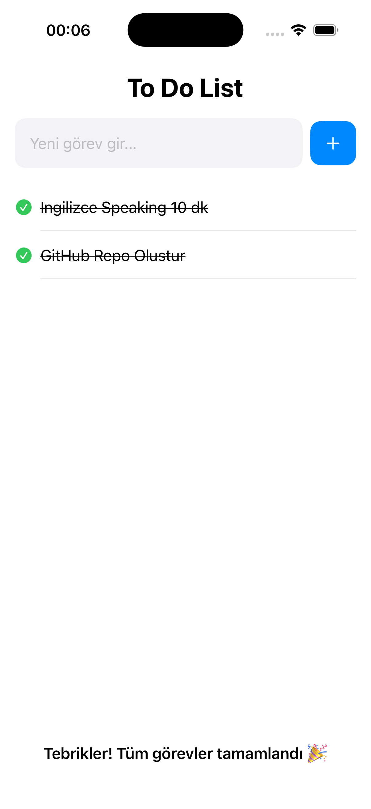

# SwiftUI To-Do App 📝

Basit ve şık bir SwiftUI To-Do uygulaması.  
Görev ekleme, silme, tamamlama ve düzenleme özelliklerine sahiptir.  
Veriler cihazda saklanır (UserDefaults).

---

## 🚀 Özellikler
- ➕ Görev ekleme  
- 🗑️ Görev silme (kaydırarak)  
- ✏️ Görev düzenleme (sağa kaydır → düzenle)  
- ✅ Tamamlandı işaretleme  
- 💾 Kalıcı kayıt (UserDefaults)  
- 🎉 Tüm görevler tamamlanınca animasyon

---

## 📸 Ekran Görüntüleri

  
  

## 🛠️ Kullanılan Teknolojiler
- Swift  
- SwiftUI  
- MVVM Mimari
- UserDefaults  

---
